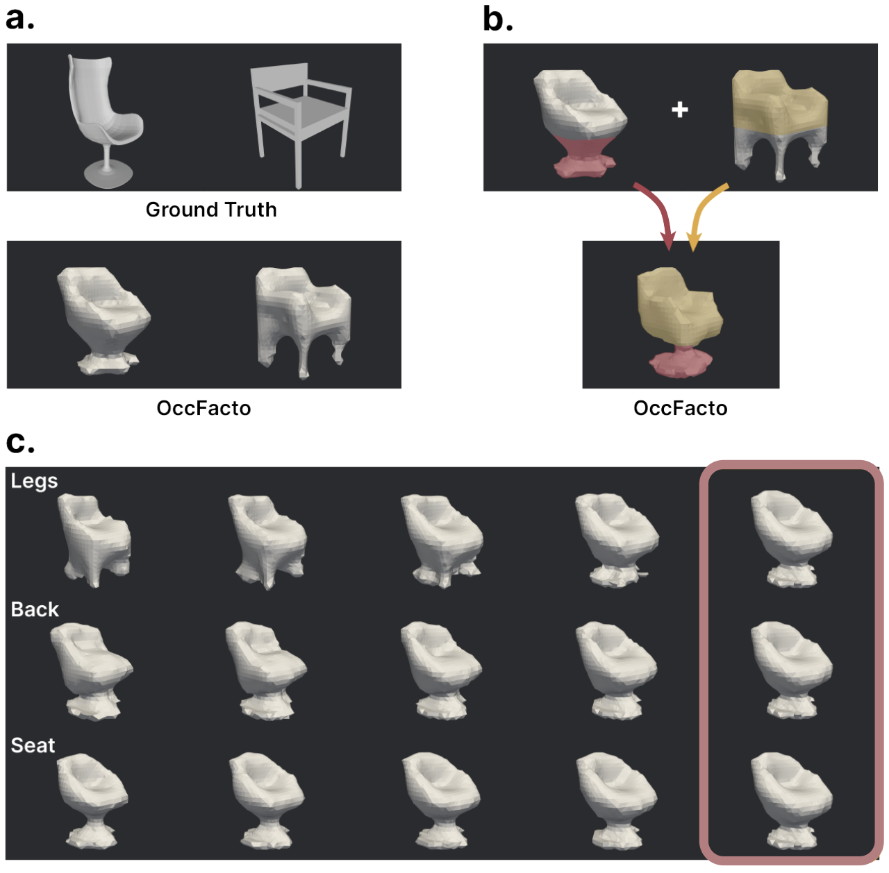

# OccFacto
### By Aniketh Iyengar and William Pan (CS 236 Fall 2023)
We present OccFacto, a novel model that takes in an input of part-segmented styles of 3D objects, learns an implicit function that outputs occupancy values to represent 3D shapes as meshes, and enables generation of coherent  and plausible 3D objects with part-based control. Our model is an enhanced version of [DiffFacto](https://github.com/diffFacto/diffFacto), an established cross-diffusion model originally designed for the creation of part-stylized 3D point clouds. Through mesh-based shape optimization, our approach unlocks new avenues for generating coherent and plausible three-dimensional objects, holding significant implications for product design, mechanical engineering, and manufacturing sectors. For our model, we will be inputting a set of shapes S that we want to learn the distribution of. Given each S^(i) in **S**, we will model the shape by a factorized prior based on semantic parts, consisting of a canonicalized geometry and a transformation. Through a continuous normalizing flow model, transformation sampler, and a final occupancy network, we will output a mesh representation of a fully built shape with any arbitrary part style.




---

### Installation
Make sure to have conda installed to install the following packages:

```
cd src
conda activate occFacto
pip install torch==1.12.1+cu113 torchvision==0.13.1+cu113 torchaudio==0.12.1 --extra-index-url https://download.pytorch.org/whl/cu113
pip install torchdiffeq==0.0.1 tqdm tensorboardX pypaml plyfile einops numpy==1.23.5 scipy scikit-learn einops
pip install python/occFacto/utils/metrics/chamfer_dist python/occFacto/utils/metrics/emd
conda install -c conda-forge pyvista
pip install pymcubes pycollada 
```

To download the data for encoder, please run:
```
wget http://download.cs.stanford.edu/orion/DiffFacto/data.zip
```
To download data for the occupancy network, please follow the steps for preprocessed data on [Occupancy Network](https://github.com/autonomousvision/occupancy_networks/tree/master) paper.


---

### Usage
To run the train script:

```
cd src/python/occFacto/models
python occFactoTrain.py
```

To visualize, we can run `get_latents.py` to get a saved torch tensor of the latents of a ground truth chair. Then we can run `interpolation.py` to interpolate the values over a part. We can also do `visualize_all.py` to save isometric views of the reconstructed chairs. To run the interpolation / visualization scripts

```
cd src/visualization/
python [insert_name].py
```